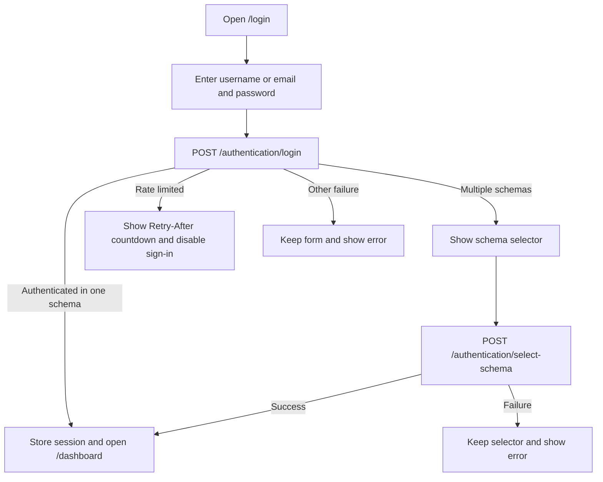
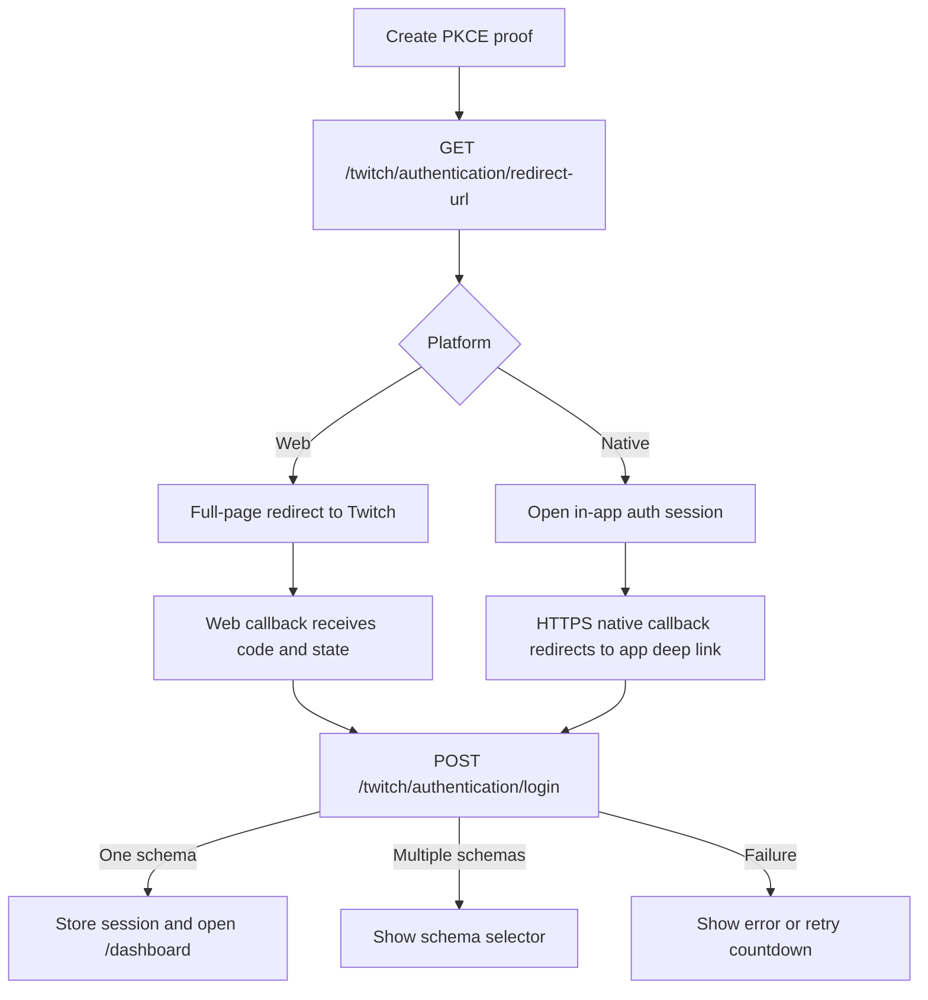
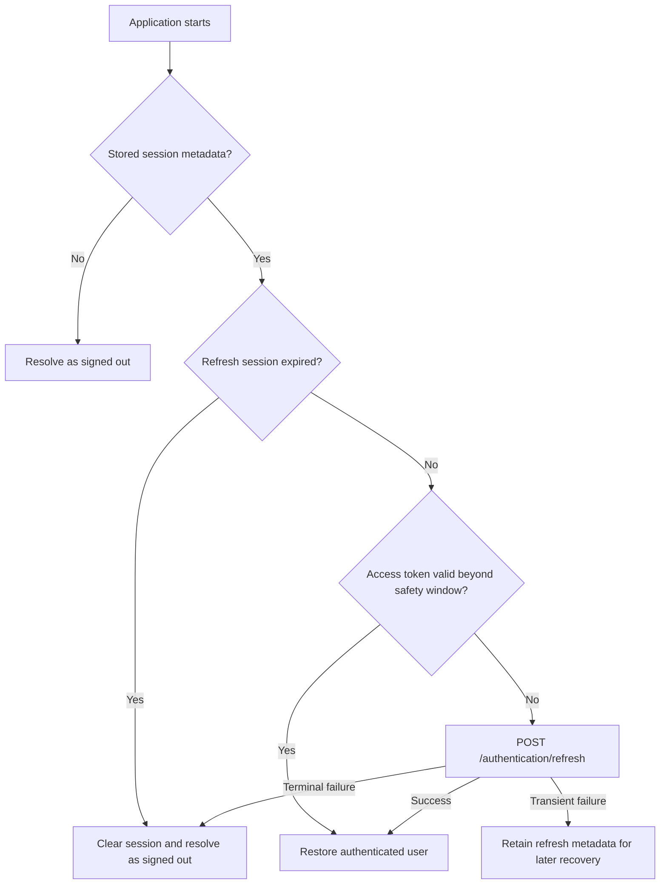
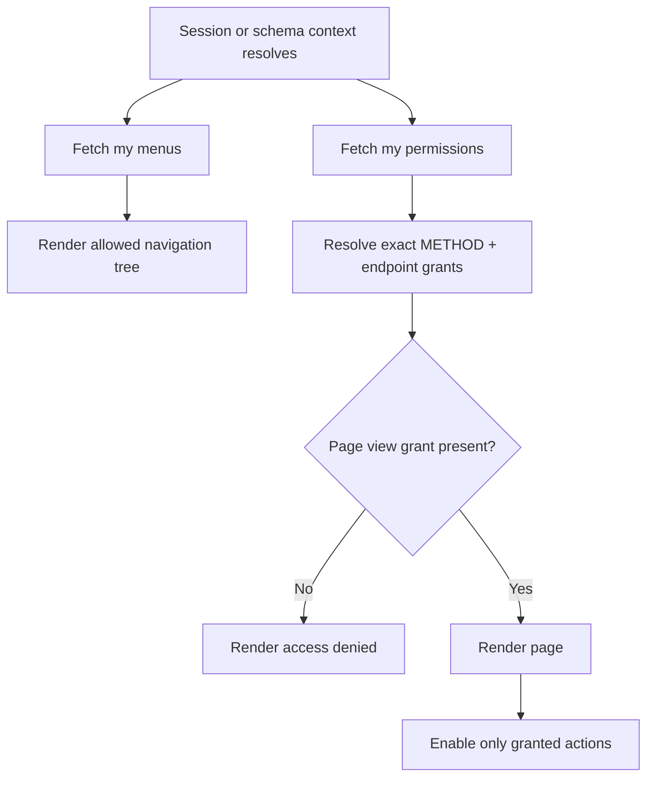
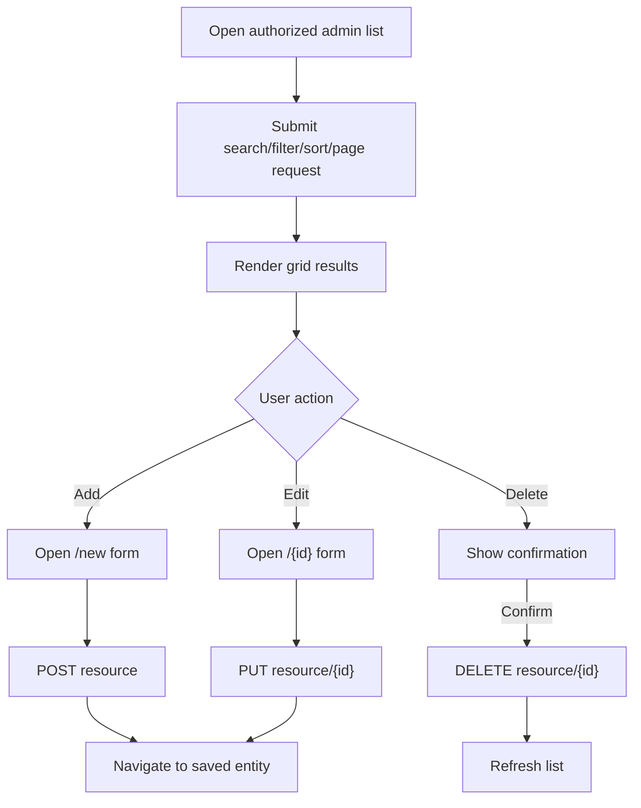

# Client user flows

**Document ID:** RMC-FLOW-001
**Snapshot date:** 2026-07-23
**Status:** Current implementation

## FLOW-001 — Credential sign-in

The form does not clear entered values after an authentication error. A server-provided retry
window disables both credential and external-provider actions until the countdown ends.

## FLOW-002 — Twitch sign-in

The PKCE verifier remains client-held and is paired with the state returned by the backend.
Cancelling the native flow discards the pending proof.

## FLOW-003 — Startup session restoration

## FLOW-004 — Permission-aware navigation

Web attempts to seed menus and permissions during server rendering. Native performs the fetch after
startup. Both clients refetch when login, logout, or selected schema changes.

## FLOW-005 — Administration list to edit

Add, edit, and delete controls are independently disabled when their endpoint grants are absent.

## FLOW-006 — Assignment tab save

Used for user roles, user schemas, blocked permissions, and role permissions.

1. Open an existing entity and select the assignment tab.
2. Load the complete assignable catalog with current selections.
3. Filter or change selections locally.
4. Select **Save** to submit the desired state through the resource bulk endpoint.
5. If the user changes tabs while dirty, require confirmation before discarding changes.

## FLOW-007 — Inline property editing

Used for permissions, schema properties, system properties, and user configuration.

1. Load rows through the search endpoint.
2. If both update and bulk grants exist, render editable cells.
3. Allow a per-row update or a save-all bulk request.
4. Keep audit columns read-only.
5. Refresh or reconcile the grid after a successful mutation.

## FLOW-008 — Request investigation

1. Search request logs using status, method, URL, authentication, and other grid filters.
2. Open a request row to view request, response, access, body/header, and audit metadata.
3. If an IP lookup is associated, open the **Log IP** tab.
4. Review location, provider, network classification, lookup date, and audit metadata.
