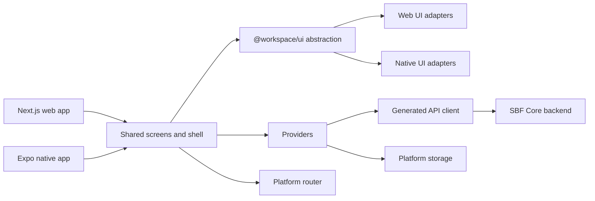

# Frontend technical architecture

**Document ID:** RMC-TECH-ARCH-001
**Snapshot date:** 2026-07-23
**Audience:** Developers, architects, security reviewers

## System context



## Runtime applications

| Application | Technology | Routing | Initial data |
| --- | --- | --- | --- |
| `apps/web` | Next.js 16, React 19, App Router | Files under `apps/web/app` | SSR attempts menus, permissions, language config, and selected edit records |
| `apps/native` | Expo SDK 55, React Native 0.83, Expo Router | Files under `apps/native/src/app` | Providers fetch client-side; safe-area wraps the complete shell |

## Package responsibilities

| Package | Responsibility | Key constraint |
| --- | --- | --- |
| `@workspace/storage` | Typed local/session storage; cookies on web; MMKV/SecureStore-related native adapters | Leaf package |
| `@workspace/i18n` | i18next initialization, languages, translation hooks | Depends on storage |
| `@workspace/api-client` | Axios transport, React Query, Orval-generated hooks/types, typed permission keys | Generated files are not hand-edited |
| `@workspace/providers` | Auth, permissions, menus, language, theme, sidebar, breadcrumbs, query composition | Owns session-aware application state |
| `@workspace/web-ui` | Vendored web primitives | Private to `@workspace/ui` |
| `@workspace/native-ui` | Vendored native primitives | Private to `@workspace/ui` |
| `@workspace/ui` | Cross-platform primitives, forms, overlays, grid, PDF result | Every public component keeps synchronized web/native contracts |
| `@workspace/router` | Common Link and router contract | Selects Next or Expo implementation at build time |
| `@workspace/app` | Shared screens, navigation chrome, overlays, app shell | Contains business-facing UI |
| `apps/*` | Route adapters and runtime setup | Thin consumers of shared packages |

## Dependency direction

```text
storage
  ├── api-client
  ├── i18n
  └── ui

web-ui/native-ui → ui
ui → router → providers → app → apps
api-client/i18n/storage also feed providers, ui, app, and apps where allowed
```

`@workspace/ui` cannot depend on `@workspace/router`, because the router already depends on the UI
abstraction. Navigation-aware UI takes injected callbacks.

## Application composition

Both runtimes mount:

1. theme provider;
2. shared provider stack;
3. shared `AppShell`;
4. platform router outlet.

The provider stack owns query, storage, authentication, language, menus, permissions, navigation
state, and overlays. The shell owns visual chrome and consumes provider state.

## Web render path

The Next.js root layout:

1. converts request cookies into the storage server adapter;
2. resolves the initial language;
3. attempts to fetch menus, permissions, and language configuration;
4. passes the results as serialized provider seeds;
5. renders the shared shell and route screen;
6. allows providers to fall back to client fetches if SSR calls fail.

Permission SSR seeds are read directly while active to keep server and hydration markup identical.

## Native render path

Expo mounts the provider stack without SSR seeds. It wraps the full shell in safe-area padding and
renders an Expo Router stack with native headers disabled because the shared shell supplies chrome.

## API generation

`packages/api-client/openapi.json` is the checked-in backend contract. `pnpm generate` runs Orval
and then generates typed endpoint permission unions. Generated hooks, DTOs, transport functions,
and permission keys are consumed by screens and providers.

## Styling and responsive design

- Web uses Tailwind v4 through `@workspace/web-ui`.
- Native uses Tailwind v3 plus NativeWind v4 through `@workspace/native-ui`.
- Shared screens use the same `className` contract.
- Platform differences use `.native.ts`/`.native.tsx` resolution, not runtime platform checks.
- Grid column priorities and expandable rows preserve access to low-priority fields on narrow
  screens.

## State ownership

| State | Owner |
| --- | --- |
| Server data and mutations | React Query/generated API client |
| Authenticated session | Auth provider plus storage/transport |
| Selected schema | Auth provider and storage |
| Menu tree | Menu provider |
| Effective endpoint grants | Permission provider |
| Language configuration | Language provider/i18n |
| Theme | Theme provider |
| Sidebar/breadcrumb UI | Shell providers |
| Local form/grid interaction | Screen and UI component state |

